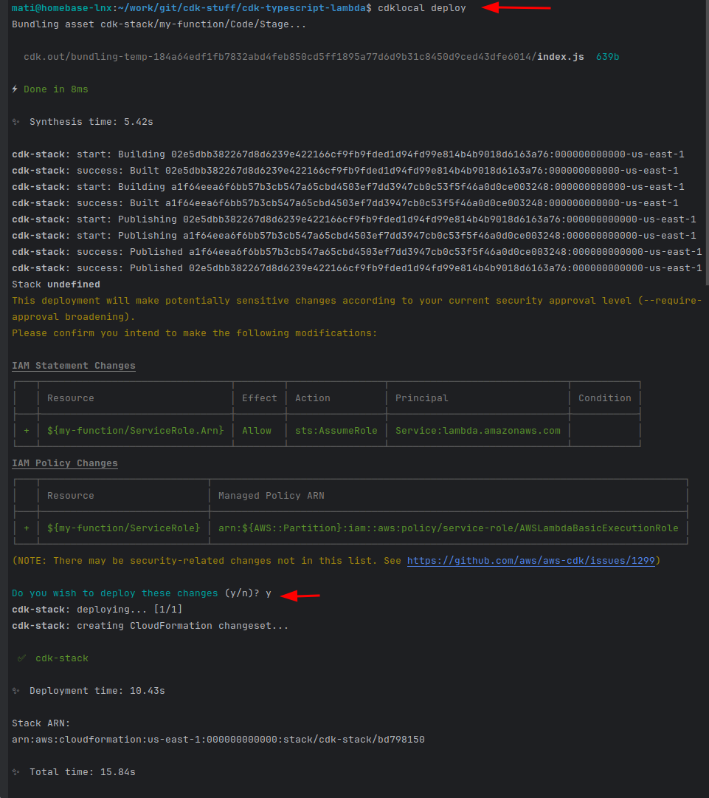
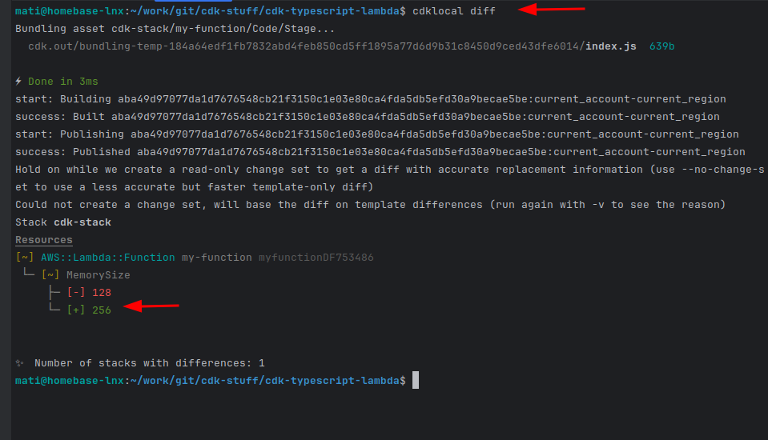
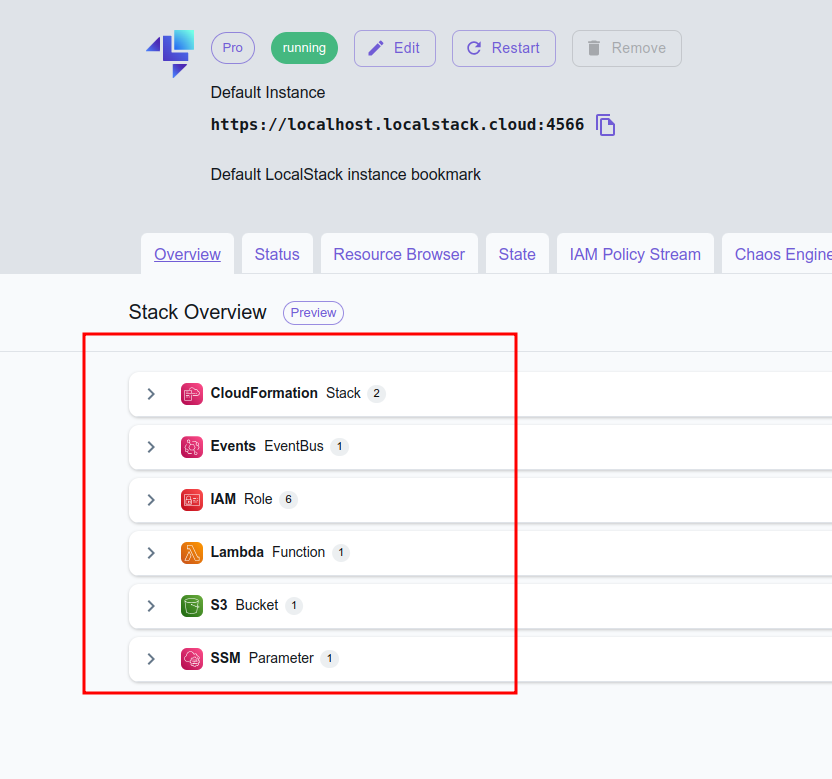
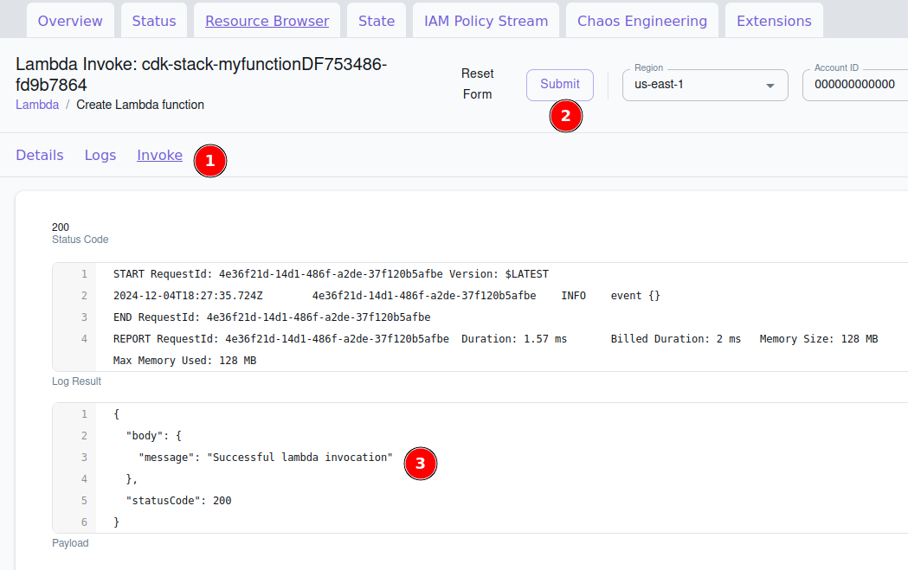

## preface

---

Creating an AWS Lambda function with [AWS CDK (Cloud Development Kit)](https://aws.amazon.com/cdk/) using TypeScript and
testing it locally with LocalStack can streamline your development process. First, you need to set up your CDK project
by installing the necessary dependencies, such as **aws-cdk** and **@aws-cdk/aws-lambda**. Once your environment is
ready, you define your Lambda function within the CDK stack, specifying the runtime, handler, and the code source. The
code for your Lambda is typically placed in a separate directory, and you can write it in JavaScript or TypeScript.

With [LocalStack](https://www.localstack.cloud/), you can simulate AWS services locally. You integrate LocalStack with
your CDK project by pointing your AWS CLI and SDKs to LocalStack's endpoints. This setup allows you to deploy and test
your Lambda functions locally, mimicking the AWS environment without incurring costs or delays associated with deploying
to the cloud. This approach enhances your development workflow by enabling rapid iteration and testing before the final
deployment to AWS. By combining CDK, TypeScript, and LocalStack, you can efficiently manage your infrastructure as code
and ensure your serverless applications are robust and ready for production.

The entire codebase is available [here](https://github.com/matikepa/cdk-stuff).

---

## steps

Given the power and complexity of LocalStack, I'll keep things straightforward. I'm using the pro version (with a 14-day
trial) because it provides a user-friendly interface for my convenience. To follow along,
please [create an account](https://app.localstack.cloud/sign-up) to
replicate my steps.
Prerequisites

- Docker
- node.js and npm installed locally

Steps

- Clone the repository.
- Follow the instructions in the README.

Below, I'll illustrate the steps through screenshots to guide you.

## Usage

- Clone the [repository](https://github.com/matikepa/cdk-stuff)

```bash
git clone https://github.com/matikepa/cdk-stuff
```

- Install the code dependencies

```bash
cd cdk-stuff
npm install
```

- Install dependencies for LocalStack

```bash
# Install globally
npm install -g aws-cdk-local aws-cdk

# Verify it installed correctly
cdklocal --version
# e.g. 2.171.1 (build a95560c)
```

- Run LocalStack

Inside the repo there is a docker-compose file ready to fly.
Make sure you exported the auth token prior to running docker compose!

```bash
export LOCALSTACK_AUTH_TOKEN="yourSecretTokenFromLocalstack"
docker-compose -f localstack/docker-compose.yml up
```

After the container is ready to go you can check it directly from the web page where you have created your account
[https://app.localstack.cloud/inst/default/overview](https://app.localstack.cloud/inst/default/overview)

- Bootstrap to activate CloudFormation Api

  If this step fails at the first time please stop the localstack container and remove the
  **localstack/volume** folder with sudo permissions from the cloned repo!

```bash
cdklocal bootstarp
```


- Deploy your changes to LocalStack

```bash
cdklocal deploy
```



- Update your config and check the drift

```bash
cdklocal diff
```



- Check the results
  

- Search the Lambda resource
  

- Invoke the Lambda and see your results
  

## That's it! :tada:
